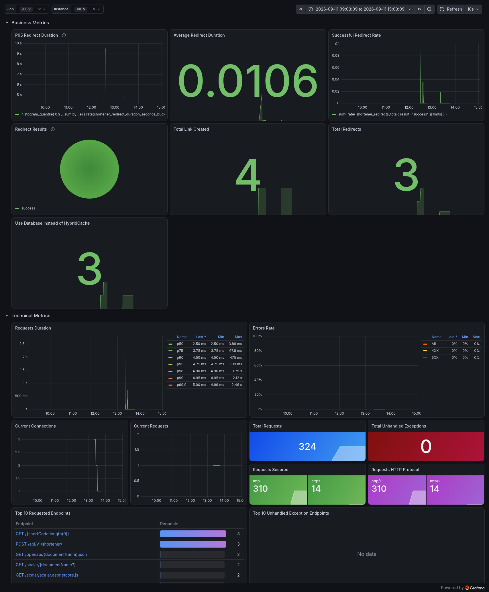

# URL Shortener

A production-oriented URL Shortener API built with **.NET 10**, **MongoDB**, **HybridCache**, and **OpenTelemetry**.

This project was created as a practical system-design exercise and portfolio project, with focus on backend architecture, MongoDB, deterministic short-code generation, caching, centralized error handling, observability, and automated testing.

## Features

- Create shortened URLs
- Redirect short URLs to their original destination
- Dynamic expiration date provided by the caller
- URL validation with FluentValidation
- MongoDB persistence
- Unique and query indexes
- Atomic sequence generation with MongoDB
- Non-sequential, hard-to-guess short codes
- Hybrid caching with L1 in-memory cache and L2 Redis
- Configurable cache enable/disable switch
- Centralized error handling with Problem Details
- OpenTelemetry metrics
- Prometheus monitoring
- Grafana visualization
- Unit tests for short-code generation and expiration validation

## Tech Stack

- .NET 10
- ASP.NET Core Minimal APIs
- MongoDB
- MongoDB Entity Framework Core Provider
- MongoDB .NET Driver
- Microsoft.Extensions.Caching.Hybrid
- StackExchange.Redis
- FluentValidation
- OpenTelemetry
- Prometheus
- Grafana
- xUnit
- FluentAssertions
- NSubstitute
- Scalar / OpenAPI
- Docker

## Architecture Overview

```text
Client
  │
  ├── POST /api/v1/shortener
  │       ↓
  │   ShortenService
  │       ↓
  │   Atomic Mongo Sequence
  │       ↓
  │   Feistel Permutation
  │       ↓
  │   Base62 Encoding
  │       ↓
  │   MongoDB
  │
  └── GET /{shortCode}
          ↓
      HybridCache
      ├── L1 Memory
      ├── L2 Redis
      └── MongoDB fallback
          ↓
      Redirect
```

Observability flow:

```text
Shortener API
     ↓
OpenTelemetry Metrics
     ↓
Prometheus
     ↓
Grafana
```

## API

### Create Short URL

```http
POST /api/v1/shortener
```

Example request:

```json
{
  "longUrl": "https://example.com/some/very/long/url",
  "expirationDate": "2026-10-10T18:00:00+02:00"
}
```

Example response:

```text
https://localhost:7261/0aK91PxQz
```

The caller defines when the generated short URL should expire.

### Redirect

```http
GET /{shortCode}
```

Example:

```http
GET /0aK91PxQz
```

If the short code exists and has not expired, the API returns an HTTP redirect to the original URL.

## MongoDB Model

The main URL document contains data similar to:

```javascript
{
  ShortenedCode: "0aK91PxQz",
  DestinationURL: "https://example.com/...",
  CreatedOn: ISODate("2026-09-11T10:00:00Z"),
  ExpirationDate: ISODate("2026-10-10T16:00:00Z")
}
```

A separate sequence document is used to generate unique numeric IDs atomically:

```javascript
{
  _id: "short-url",
  Value: 12345
}
```

## MongoDB Access Strategy

The project intentionally uses both the MongoDB EF Core provider and the native MongoDB Driver.

```text
MongoDB
│
├── EF Core Provider
│   └── UrlTags
│       ├── queries
│       └── persistence
│
└── Native MongoDB Driver
    └── Sequences
        └── atomic findOneAndUpdate + $inc
```

EF Core is used for regular URL persistence and queries.

The native MongoDB Driver is used for sequence generation because MongoDB-native operations such as `$inc`, `findOneAndUpdate`, and `upsert` are a better fit for atomic counter behavior.

## Short-Code Generation

The project does not generate a random code and then query MongoDB to check for collisions.

Instead, the generation pipeline is:

```text
MongoDB Atomic Counter
        ↓
Unique Sequence
        ↓
52-bit Feistel Permutation
        ↓
HMAC-SHA256 Round Function
        ↓
Base62 Encoding
        ↓
9-character Short Code
```

### Atomic Counter

MongoDB `$inc` generates unique sequential values atomically:

```text
Request A → 1001
Request B → 1002
Request C → 1003
```

### Feistel Permutation

Sequential IDs are predictable, so the numeric sequence is transformed into a keyed permutation.

The Feistel round function uses **HMAC-SHA256** with a secret key.

### Base62

The resulting number is encoded using:

```text
0123456789ABCDEFGHIJKLMNOPQRSTUVWXYZabcdefghijklmnopqrstuvwxyz
```

The current short-code length is **9 characters**, operating within a 52-bit sequence space:

```text
2^52 - 1
```

## Database Indexes

Current MongoDB indexes:

```text
ShortenedCode
→ Unique Index

DestinationURL
→ Query Index

ExpirationDate
→ Query Index
```

The unique index on `ShortenedCode` remains as the final database-level safety guarantee.

## Hybrid Cache

Redirect resolution uses ASP.NET Core `HybridCache`.

```text
Request
  ↓
L1 Memory Cache
  ↓ miss
L2 Redis
  ↓ miss
MongoDB
  ↓
Populate Redis + Memory
  ↓
Return
```

This reduces MongoDB reads for frequently accessed short URLs.

HybridCache also provides stampede protection for concurrent requests targeting the same cache key within the same application instance.

### Cache Key

```text
r:{shortCode}
```

### Cached Data

Only the fields required for redirect resolution are cached:

```csharp
public sealed record RedirectCacheItem(
    string DestinationURL,
    DateTime ExpirationDate);
```

The URL expiration date is always checked after cache resolution, so an expired link is never redirected even if a cache entry still exists.

## Cache Configuration

Example:

```json
{
  "Cache": {
    "UseCache": true,
    "ExpirationInMinutes": 30,
    "LocalCacheExpirationInMinutes": 5
  }
}
```

Meaning:

```text
UseCache
→ Enables or disables caching

ExpirationInMinutes
→ L2 Redis lifetime

LocalCacheExpirationInMinutes
→ L1 in-memory lifetime
```

## Error Handling

The API uses centralized error handling based on:

- `IExceptionHandler`
- `IProblemDetailsService`
- `ProblemDetails`
- stable application error codes
- a central error catalog
- an exception translator

Flow:

```text
Exception
    ↓
ExceptionTranslator
    ↓
ErrorCode
    ↓
ErrorCatalog
    ↓
GlobalExceptionHandler
    ↓
ProblemDetails
```

Expected business outcomes are represented with `Result<T>` rather than exceptions.

Current redirect behavior:

```text
Invalid short code → 400
Short code not found → 404
Expired URL → 410
Valid URL → 302
Database unavailable → 503
Unexpected error → 500
```

## Observability

The project uses **OpenTelemetry Metrics** and exposes application metrics to **Prometheus**.

Prometheus stores the time-series data and **Grafana** is used for visualization.

```text
Shortener API
     ↓
OpenTelemetry
     ↓
/metrics
     ↓
Prometheus
     ↓
Grafana
```

### Current Custom Metrics

```text
shortener.links.created
→ Successfully created short URLs

shortener.redirects
→ Redirect requests grouped by result

shortener.redirect.duration
→ Redirect resolution duration

shortener.cache.database_fallback
→ Cache lookups that required MongoDB
```

Redirect result labels currently include:

```text
success
expired
not_found
error
canceled
```

The project intentionally avoids using `shortCode` as a Prometheus label to prevent high-cardinality metrics.

### Observability Dashboard

<p align="center">
  
</p>

<p align="center">
  <em>Business and technical metrics visualized with Prometheus and Grafana.</em>
</p>

The dashboard includes both application-level and business-level metrics, such as:

- request duration
- error rate
- total requests
- current connections
- top requested endpoints
- total links created
- total redirects
- redirect results
- successful redirect rate
- average redirect duration
- P95 redirect duration
- database fallback usage

## Prometheus

Prometheus runs as shared Docker infrastructure and can monitor multiple applications.

Example target:

```text
host.docker.internal:5180
```

Prometheus scrapes:

```text
/metrics
```

Example monitoring architecture:

```text
Shortener API ──────┐
Catalog API ────────┤
Media API ──────────┼──→ Prometheus
Future Services ────┘
```

## Grafana

Grafana runs in Docker and uses Prometheus as its data source:

```text
http://prometheus:9090
```

The Grafana dashboard combines:

```text
Technical Metrics
→ ASP.NET Core instrumentation

Business Metrics
→ Custom Shortener metrics
```

This provides both infrastructure-level visibility and application-specific insight.

## Time Handling

The application uses `TimeProvider` instead of directly depending on `DateTime.UtcNow`.

```csharp
TimeProvider.System
```

This improves testability, especially for expiration-related behavior.

## Unit Tests

A dedicated test project is used:

```text
Tests/
└── Shortener.UnitTests/
```

### ShortCodeGenerator Tests

Current tests verify:

- output length is 9 characters
- output contains only Base62 characters
- the same sequence produces the same code
- different sequences produce different codes
- invalid sequences are rejected
- the maximum supported sequence succeeds
- values outside the 52-bit range fail
- a large range of sequential values produces no duplicates

### Expiration Validation Tests

Expiration validation is tested using `FakeTimeProvider`.

The tests cover:

```text
Future expiration → Valid
Past expiration → Invalid
Expiration equal to current time → Invalid
```

The tests follow the AAA pattern:

```text
Arrange
Act
Assert
```

## Testing Strategy

Pure application logic is covered by Unit Tests.

MongoDB atomic behavior is better suited to Integration Tests than mocked Unit Tests.

Planned integration test:

```text
100 concurrent requests
        ↓
MongoDB atomic $inc
        ↓
100 unique sequence values
```

A future integration-test project can use MongoDB through Testcontainers.

## Configuration

Sensitive values are not stored in source control.

### Development

User Secrets are used for values such as:

```text
ShortenerSettings:SecretKey
ConnectionStrings:ShortenerURLContext
ConnectionStrings:Redis
```

### Production

Sensitive values should be supplied through environment variables or an external secret store.

Example:

```text
ShortenerSettings__SecretKey
ConnectionStrings__ShortenerURLContext
ConnectionStrings__Redis
```

## Current Project Direction

The project currently demonstrates:

```text
.NET Minimal APIs
MongoDB
Atomic ID generation
Feistel permutation
Base62 encoding
Hybrid caching
Redis
Centralized error handling
OpenTelemetry
Prometheus
Grafana
Unit testing
```

Future areas may include:

- integration tests with MongoDB
- cache integration tests
- redirect analytics
- click tracking
- rate limiting
- distributed tracing
- structured logging
- OpenTelemetry Collector
- Grafana Tempo / Loki
- cleanup of expired URLs
